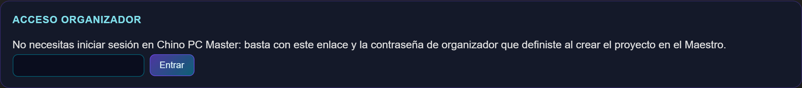
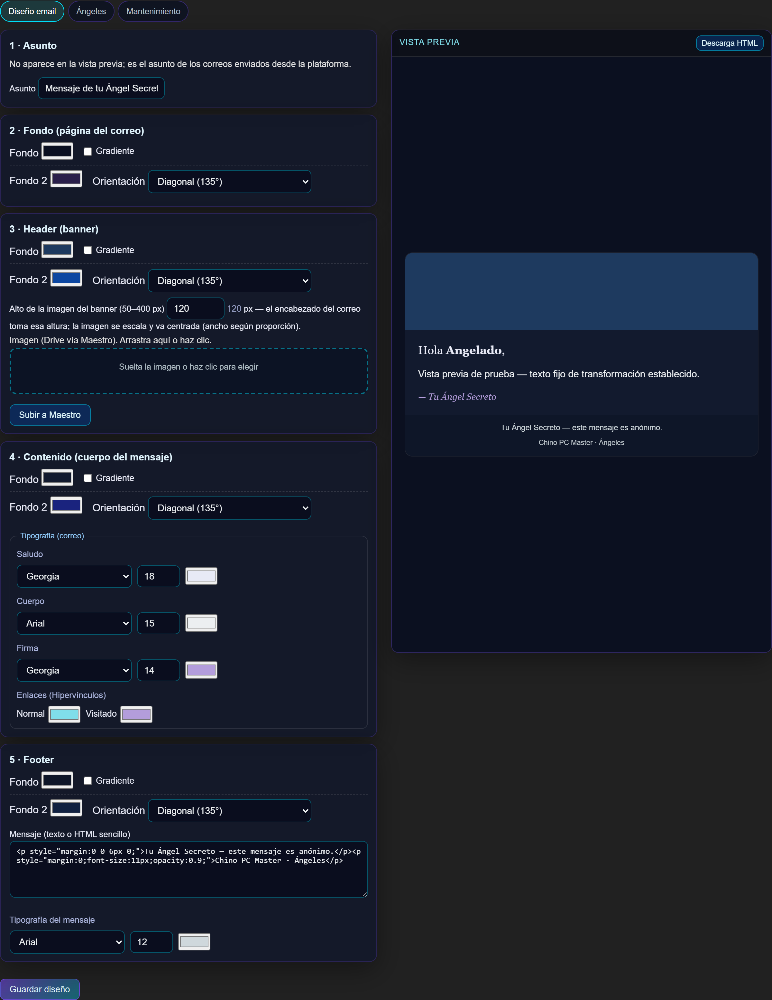
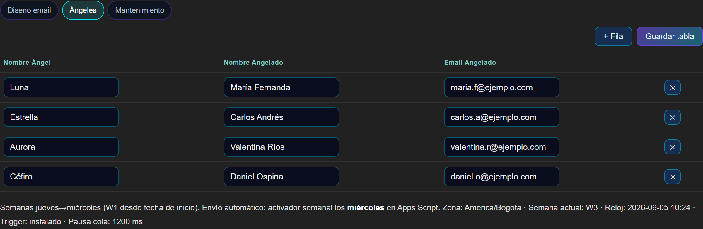
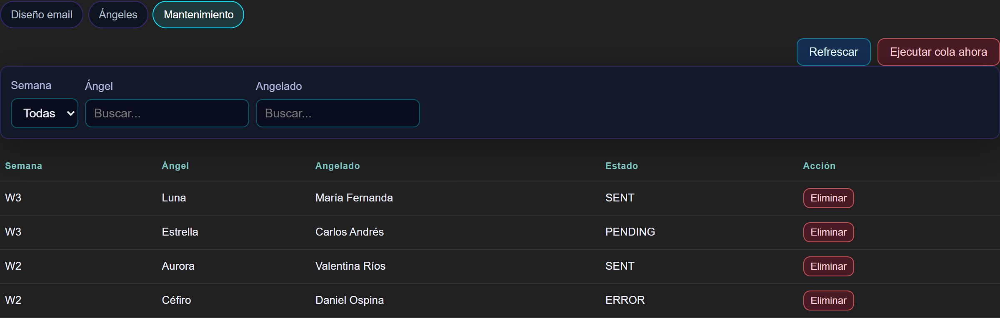
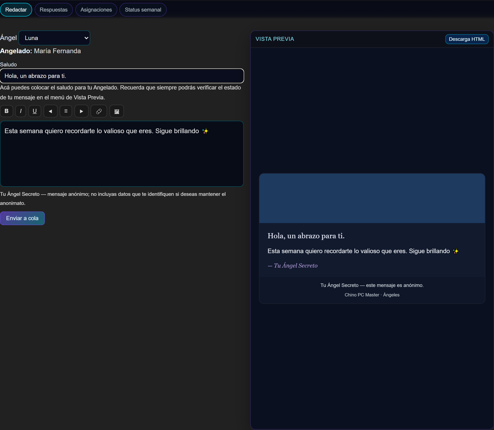
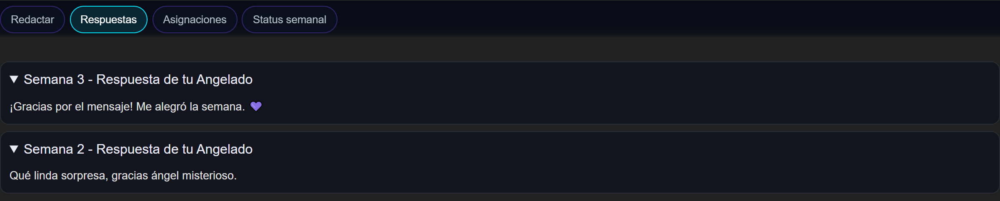
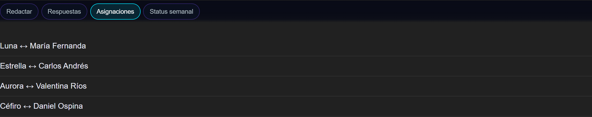
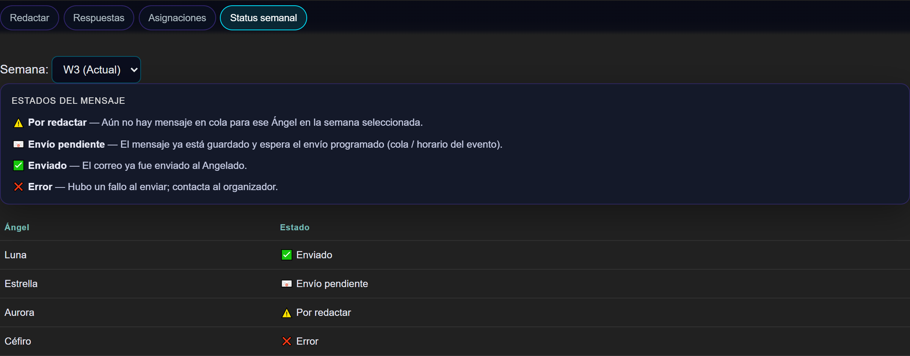
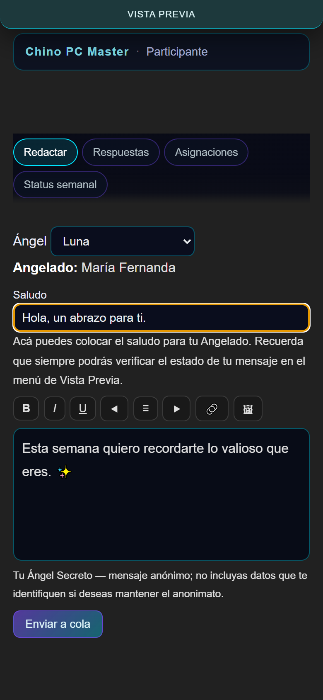

# Ángeles Secretos — Catálogo de funciones

Documento de referencia: qué hace la app, separado por los dos paneles que usan las personas del evento.
Las capturas están en [`docs/angeles-capturas/`](angeles-capturas/) y se generaron con datos de demostración.

> El panel Maestro (`#angels-dashboard`) queda fuera de este documento a propósito: es la consola interna
> de administración y no forma parte de lo que usan capitanes ni ángeles. Sus capturas siguen guardadas
> en la carpeta (`01-maestro-*` a `05-maestro-*`) por si hacen falta para documentación interna.

**Cómo funciona, en una línea:** el sitio web es la interfaz; el correo se compone con el diseño que
define el capitán y sale automáticamente, cada semana, desde el Gmail de la cuenta del propio evento.

---

## Los dos accesos

| Panel | Cómo se entra | Quién lo usa |
|---|---|---|
| **Capitanes** | `#a/<hash>` — el enlace + la contraseña del proyecto, **sin cuenta en el sitio** | Quien monta y conduce el evento |
| **Ángeles** | `#u/<hash>` — solo el enlace, **sin contraseña ni cuenta** | Quienes juegan y escriben |

Ambos enlaces son públicos por diseño: no hay registro, no hay fricción, no hay app que instalar.

---

## 1 · Panel Capitanes (`#a/<hash>`)

Entrada con enlace + contraseña propia del proyecto. La sesión queda desbloqueada en ese navegador.

### 1.1 Diseñador de email con vista previa en vivo

Editor visual de la plantilla del correo, dividido en 5 bloques, con **vista previa en tiempo real**:

1. **Asunto** del correo.
2. **Fondo de la página** — color plano o gradiente (diagonal, vertical, horizontal o radial).
3. **Header/banner** — color o gradiente, altura configurable (50–400 px) y **subida de imagen**
   por arrastrar‑y‑soltar; el banner queda alojado en Drive.
4. **Contenido** — fondo propio y tipografía independiente para **saludo, cuerpo y firma**
   (familia, tamaño en px y color), más color de **enlaces normales y visitados**.
5. **Footer** — fondo, mensaje libre en texto o HTML y su propia tipografía.

Extras: botón **Descarga HTML** para exportar la plantilla renderizada y **Guardar diseño** para
dejarla fija en el proyecto. Lo que el capitán ve es exactamente lo que recibirá el angelado.

### 1.2 Ángeles y Angelados

- Tabla editable: **Nombre del Ángel**, **Nombre del Angelado** y **email del Angelado**.
- Añadir filas, editar en línea, eliminar y guardar la tabla completa.
- Estado del envío en vivo: **zona horaria, semana actual calculada, reloj del servidor** y si el
  **envío automático está activo**.
- El ciclo de semanas corre de jueves a miércoles, con W1 desde la fecha de inicio del proyecto.

### 1.3 Mantenimiento y cola de envíos

- Listado de todos los mensajes en cola con **semana, ángel, angelado y estado** (SENT / PENDING / ERROR).
- **Filtros** por semana, por ángel y por angelado.
- **Eliminar** un mensaje concreto antes de que salga.
- **Ejecutar cola ahora**: dispara el envío manualmente sin esperar al activador semanal.
- **Refrescar** para ver el estado actualizado.

---

## 2 · Panel Ángeles (`#u/<hash>`)

Sin registro, sin contraseña: se abre el enlace y ya está. Cuatro pestañas.

### 2.1 Redactar

- Selector de **Ángel**; la app muestra automáticamente a quién le escribe (**Angelado**).
- Campo de **saludo** personalizado (con aviso si se deja vacío).
- **Editor enriquecido**: negrita, cursiva, subrayado, alineación izquierda/centro/derecha,
  **inserción de hipervínculos** con texto visible y URL, e **inserción de imágenes**.
- **Vista previa en vivo** del correo final, con el diseño exacto que configuró el capitán.
- **Descarga HTML** del mensaje.
- **Enviar a cola**: el mensaje queda guardado como pendiente, listo para el envío programado.
- Aviso de anonimato visible en el propio editor.

### 2.2 Respuestas

Bandeja en acordeón con las respuestas recibidas del angelado, agrupadas y rotuladas por semana.
El hilo se mantiene sin romper el anonimato.

### 2.3 Asignaciones

Lista de las parejas Ángel ↔ Angelado que le corresponden a ese enlace.

### 2.4 Status semanal

- Selector de semana (con la actual marcada).
- Estado por cada Ángel, con leyenda explicada:
  - ⚠️ **Por redactar** — aún no hay mensaje en cola esa semana.
  - 📧 **Envío pendiente** — guardado, esperando el envío programado.
  - ✅ **Enviado** — el correo ya salió.
  - ❌ **Error** — falló el envío; hay que avisar al capitán.

### 2.5 En el teléfono

Interfaz responsive: en móvil la vista previa se convierte en un panel flotante accesible desde un
botón fijo, y el editor ocupa todo el ancho. Pensado para escribir desde el teléfono, que es donde
el ángel realmente está.

---

## 3 · Por qué se usa

- **Cero fricción para el ángel.** Ni registro, ni contraseña, ni app que instalar: abre el enlace y escribe.
- **El correo tiene la cara del evento.** Colores, gradientes, banner propio y tipografía por sección,
  con vista previa fiel y sin tocar HTML.
- **Sale del Gmail del evento.** El remitente es la cuenta del propio evento: nada llega desde una
  dirección desconocida.
- **Se envía solo.** Activador semanal y cola de mensajes; el capitán solo interviene si quiere
  adelantar un envío.
- **Nadie se queda a ciegas.** Cada ángel ve si su mensaje está por redactar, pendiente, enviado o con
  error, semana por semana.
- **Escribir sin prisa.** El mensaje se guarda en cola y se puede revisar antes de que salga.
- **Anonimato cuidado.** El participante nunca ve el correo del angelado dentro del mensaje, y hay
  avisos explícitos para no romper el juego.
- **Funciona en el teléfono.** La misma app en móvil, con la vista previa en un panel flotante.

---

## 4 · Cómo se reproducen estas capturas

Se tomaron con un arnés de demostración que carga `angels.html` y sustituye la capa de red
(`window.CPMAngelsApi`) por respuestas de ejemplo, de modo que se pueden fotografiar todas las vistas
sin depender de un proyecto real ni exponer datos de participantes. Los nombres, correos y hashes que
aparecen son ficticios.
